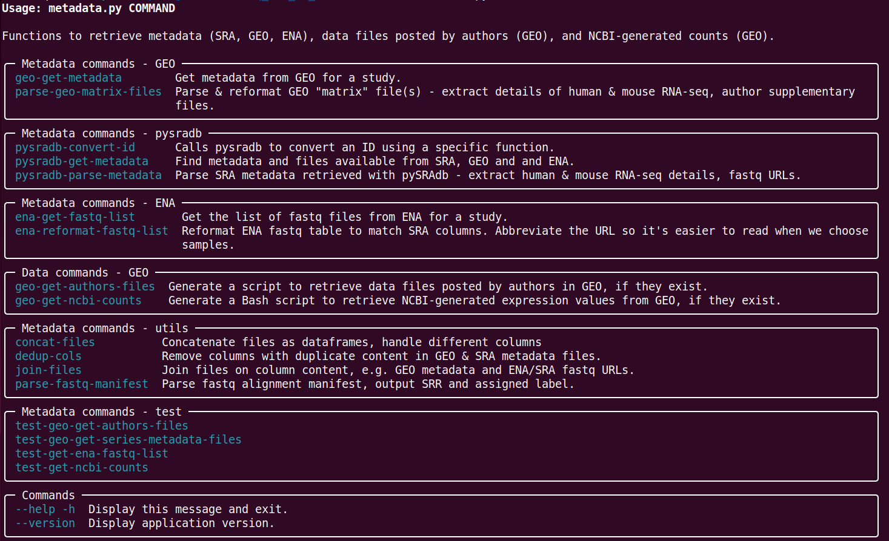

## What is the code in this repo?

A suite of Python tools that makes it possible to reprocess RNA-seq data stored in ENA or SRA with a few commands. Handles metadata, file transfers,  alignments, counts, and study-specific folllow-up. It generates Bash scripts for many steps, and stores those with the results.

### Motivation

1. Because alignments matter _per se_, and they're not available from Archs4, NCBI recounts etc. These are still great resources.
2. For reproducibility, transparency, and consistency. > 1,200 samples  re-analyzed from scratch on modest equipment, mostly human and mouse. Manuscript in preparation.
3. But really, for the parents out there whose kids have cancer.

### Workflow

This should be a diagram, but here is a summary of the workflow:

0. Retrieve and set up reference genome & transcriptome, extract gene coordinates and other ancillary files, etc. (All versions etc. are explicit and noted.)

1. Starting from a study ID reported in an article, typically a GEO series ID (GSE####), find the metadata available in GEO, SRA and ENA for samples and fastq files. Uses a combination of [pySRAdb](https://github.com/saketkc/pysradb) and direct requests.
1. Keep the original metadata files but filter, reformat and separate by species (mouse or human) and experiment type (bulk RNA-seq). Some authors have made this a royal pain.
1.  Merge sample and fastq file details; simplifies the contents, drops redundant columns, calculates the actual read length and type.
1. Choose the samples to re-analyze, which amounts to taking a subset of rows and columns from the last step. The result is a simple manifest (three columns for paired reads, two for single reads), with flexibility that's not spelled out. There can be multiple rows per sample, samples can be renamed,etc.
1. Make a read-length-specific STAR index for the target species if we don't have one already.
1. Make a BED file of the target gene(s) to post-process, technically optional but frequent. This command needs the species and gene name(s), but it's case-insensitive and it can optionally extend the boundaries; this distance and the species get baked into the name of the scripts that gets these boundaries.
1. We need to run one more command to generate all the scripts that will retrieve, align etc.
    - Required:
      - the path to the manifest.
      - a directory with the STAR index to use.
    - Optional:
      - whether to run Abra2 and/or RNAspades;
      - whether and where to move the results when they're done;
      - CPUs and/or max mem for each step, where to get the fastqs (all normally based on fastq URLs, usually ENA) and how fast; everything has a default.

This last command checks for errors to the extent possible, then creates all the temporary and permanent folders, generates separate scripts for post-alignment steps (aggregation/transformation of individual counts files, Abra2, RNASpades) and a main Bash scrip that will run retrieve/align/quantify call the post-processing scripts and clean up logs etc., with error checking along the way, and ends with results for a group of related samples in one dir.
1. Optional: if the study authors posted any files in GEO (i.e., derived results), generate a script to retrieve them.
1. Optional: if there are NCBI counts from GEO (human only, not all studies), generate a separate script to retrieve them. Each of these scripts will download the remote files to the directory where it resides.

 Abra2 (local realignment) and RNAspades (reassembly using 
  gene-specific reads + unaligned reads) are separate functions that run anytime.

## Status

Updates underway to shorten the path to publication and make it possible for others to run this code:
- separated existing functions into modules (metadata, alignment/quantification/assembly pipeline, extract specifc results from different files, making figures etc.), instead of one long script;
- converting argument handling to cyclopts, like so for metadata:

    

Some of these steps run in succession automatically.

## Acknowledgments

- All the diligent people who work at NCBI and ENA.
- The authors of STAR, featureCounts, Trackplot, samtools, pySRAdb, Archs4, and more.
- The study authors who posted their reads in GEO, SRA or ENA.

## Limitations/quirks

Some steps and assumptions in this pipeline are admittedly not practices I would use at work. For most studies of interest, read type and length are usually the same for all samples, and fastq files are often available from ENA, so I opted for simplicity. In a given alignment run/batch (i.e., retrieve reads, align, quantify, realign locally, assemble locally, etc.):

  - the same STAR index is used for all samples;
  - the index is specified manually on the command line (but then recorded in a script);
  - there is no explicit test of the read length, I think
  - Fastq URLs are formatted according to the source, which is convenient  but really unnecessary.
- The code that aggregates/reformats/transforms featureCounts output files involves multiple calls and doesn't get copied with the resuls.

