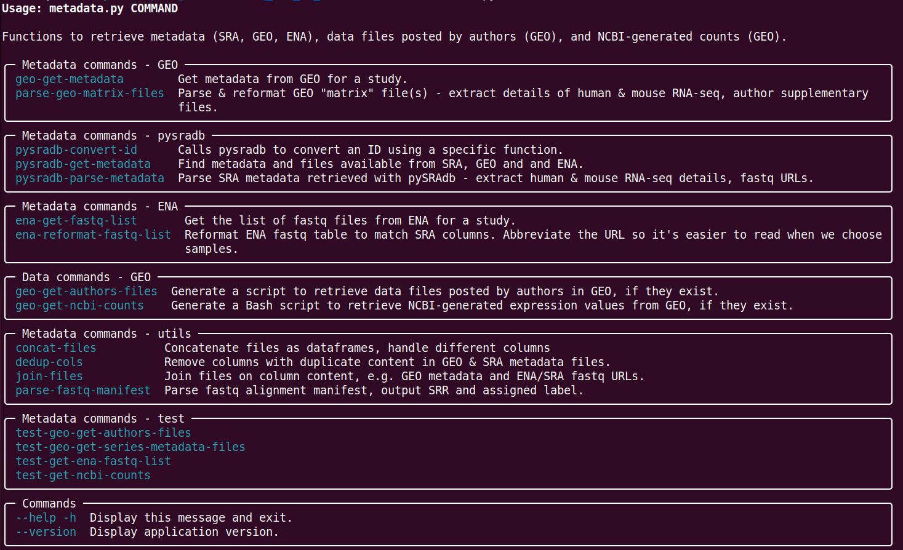

## Purpose of this code - abbreviated protocol

If you want to understand the state of cancer research, virology, or many articles about CRISPR screens, the most informative article to read is about _ACE2_:

> Front Cell Dev Biol. 2023 Dec 8;11:1290876. doi: 10.3389/fcell.2023.1290876 
> ACE2 knockout hinders SARS-CoV-2 propagation in iPS cell-derived airway and alveolar epithelial cells 
> Ryo Niwa, Kouji Sakai, Mandy Siu Yu Lung, Tomoko Matsumoto, Ryuta Mikawa, Shotaro Maehana, Masato Suzuki, Yuki Yamamoto, Thomas L Maurissen, Ai Hirabayashi, Takeshi Noda, Makoto Kubo, Shimpei Gotoh, Knut Woltjen  
> [PMC10750251](https://pmc.ncbi.nlm.nih.gov/articles/PMC10750251/)

This article was surprisingly easy to follow given that I didn't know anything about _ACE2_, other than hearing the name on the news, or about those computational tools. Everyone should read the article and at least look at every supplement. If you really don't have time, here are two highlights that will help you triage CRISPR hits etc. from now on using a few heuristics (not all here):

1. Look at Fig. 1. It shows genomic sequences, a diagram of the cDNA, and much more. The paragraph above the figure is where the results section begins.
2. Look at Fig. 3. In the knockout, _ACE2_ expression drops to 0, but otherwise there are only minor differences.

The article gives the impression that it's totally normal to look at the effect of a mutation on the genome and on the mRNA, so writing all this code may have been meaningless. The challenge:
  - Write down the date. Think "Voyage of the Beagle".
  - Start looking for articles from oncology, virology, whole-genome knockout/CRISPR screens, about a knockout, loss of any kind, deficiency, haploinsufficiency etc., and:
    - Find ONE article where RNA-seq was used to show a complete drop in mRNA expression, and/or (you decide)
    - Among the articles that include results from new RNA-seq experiments, find ONE where the authors connect the RNA-seq to the gene(s) that was allegedly knocked out.
  - Try to formulate an explanation for the global or targeted amnesia of the authors of all these articles about RNA-seq.

There is much more to share about this article, but the extraordinary thing about Fig. 3 is that it shows the complete disappearance of mRNA expression. This is exactly what we would expect to see if there is a mutation in every allele present in a cell, and every mutation leads to nonsense-mediate decay of any mRNA from that allele. The authors made clonal cell lines precisely because a mutation in one allele doesn't trigger NMD in mRNAs transcribed from any other alleles (this is true even when there is only one allele, since there is no other allele).

The reason for this pipeline is the harm caused by a series of ruses in scientific articles, web sites of national institute and academic cancer center etc., including the "belief" (coerced concept) that one frameshift mutation causes a mythical loss of function, a truncation etc. The only way to sustain this myth is to present images based on antibodies and avoid mentioning evidence, because it's completely invalid and it's consistenly applied to the same genes, some of which are known to trigger NMD globally and to escape NMD.

Please read the article about _ACE2_ and just open every supplement. I went looking for a control of sorts as an afterthought (ACE2, CRISPR, RNA-seq), after realigning RNA-seq data from many other oncology articles, then five articles about coronavirus whole-genome CRISPR screens because the top hits were clearly misrepresented. I thought it would just confirm an actual knockout, but the cDNA diagram in Fig. 1 is so informative by itself that it was a complete contrast with many, many studies. The authors bring everyone along in a guided jump to the base level, like the UCSC genome browser. That's in addition to the biological contrast, which (I think) doesn't exist in oncology and hadn't occurred to me. 

For the other kind of article described above, RNA-seq data is often unavailable, and if it is, the metadata is a mess and any results they posted are cryptic, the data is sometimes misplaced, and it appears to be fulfilling a requirement. Lots of papers have supplements with differential expression only but clearly contradicting the "loss" etc. This is consistently the case with the whole-genome COVID CRISPR papers.

The expression data posted by the authors in GEO had the same labels as the article, and it included all genes in the reference transcriptome. This is just half of the samples, for clarity:

As a consequence of this diligence, it only took me a few minutes to:
- search for the ID in the article (PRJDB15620)
- go to [GEO](https://www.ncbi.nlm.nih.gov/gds/?term=PRJDB15620)
- check if the reads appeared to be there [(18 samples)](https://www.ncbi.nlm.nih.gov/gds/?term=PRJDB15620)
- download the expression values [(Download data: TXT)](https://www.ncbi.nlm.nih.gov/gds/?term=PRJDB15620) then GSE275240_gene_tpm_ACE2KO.txt.gz
- verify the results for _ACE2_ in Fig. 3
- confirm the impression that the graph is a bit too modest - the results are even better
- verify that there weren't massive differences in mitochondrial gene expression.

There was something else. The results were obtained with a reference transcriptome that included non-standard chromosomes, which leads to overcounting for reads aligned to muliple loci and significantly inflates counts for artifactual RNAs. I have always made this choice arbitrarily, and I wasn't aware of this. Basically, the suppression of _ACE2_ is almost certainly more pronounced than the article shows.

Oh, this artifact made me understand results from Cavatica etc. There are grant-funded projects that use this artifact to construct a non-standard transcriptome offline that suppresses mitochondrial gene expression. It is the source of a rare exception to consistency in UCSC Xena data.

Lastly (for now), this article makes it possible to understand the typical purpose of RNA-seq in "loss" papers, because the changes are usually radical, namely to build a story about a vulnerability of the "loss" (always a gain-of-function mutant) that always becomes targetable, or propose a therapeutic target that will never work; the latter occurred with coronavirus screens, which ignored the highest-ranking hits because they had already been typecast.

## What's not standard

There are multiple modules in this repo, but the one dedicated to analyzing RNA-seq takes reproducibility a step further, basically assuming responsbility for the ultimate goal of contradicting an article. For every new data set to analyze, it (Python) outputs Bash scripts with hard-coded parameters for all steps, copies a Python script to later merge counts etc., in order to avoid the common practice of keeping relevant parameters in config files, sometimes many (snakemake), and to make it easy to keep all the scripts and logs with the results. The intent behind this is to make it possible to reproduce the results but suggest that it probably won't be necessary, since the underlying tools are all standard. There's no need to look up details long forgotten, or to keep this code tied to past results.

## Results

Not up to date. More results are forthcoming (in Zenodo in draft form).

Lee KDM6A: https://doi.org/10.5281/zenodo.17055095
Rathmell VHL (CRAM): https://zenodo.org/records/17058069

## Purpose(s) of this code

This repo contains a suite of Python tools that make it possible to reprocess RNA-seq data from scratch from a GEO, ENA or SRA study ID spotted in an article, or to retrieve derived results, basically with a few commands. The primary motivation for this code is to draft a scientific manuscript that will scrutinize many scientific articles, so the code is intended to minimize the need to remember relevant details.

The metadata module simplifies the process of determining what fastq files are available, and simplifies the review and selection   and makes separate scripts separately supplementary data in GEO (from the authors or NCBI). The pipeline module handles fastqs transfers, runs alignments, counts, etc., and optionally runs follow-up steps for one or more genes (local reassembly, small BAM file, etc.). 

The methods are standard and open-source, but the data needs be located, and the source of the data matters. For some studies, there is data in SRA or GEO but not both, or only in ENA. The ideal source is ENA since it lets us use Aspera for download. So another function of this code is to find the sample metadata and associate it with the sequencing data so it's easy to review. It keeps the original metadata files intact, and makes separate output files for human and mouse data. 

One of the earliest steps baked into the alignment pipeline is to generate Bash scripts to actually run commands. It keeps the scripts, logs and fastq file manifests with the outputs, and zips them if all goes well. One exception to be corrected is the postprocessing of gene counts.

There may be additional results available in GEO for a study, and there are functions that create Bash scripts to get these files if they exists, separately for data posted by the authors and for results generated by NCBI for human studies ([example](https://www.ncbi.nlm.nih.gov/geo/download/?acc=GSE119538), [explanation](https://www.ncbi.nlm.nih.gov/geo/info/rnaseqcounts.html)).
. 
There's a good chance that gene counts are already available separately thanks to the [Ma'ayan lab](https://labs.icahn.mssm.edu/maayanlab/) ([download](https://maayanlab.cloud/archs4/download.html), [awesome Python toolkit](https://github.com/MaayanLab/archs4py/)). This is not yet automated.

This is not a general-purpose pipeline. code is specifically intended t
Many of these steps  generate Bash scripts for transparency and convenience, and they are normally run in sequence but are accessible separately.

### Motivation for this effort

1. First and foremost, the objective is to obtain and review details that are not available even if the data has been reprocessed.
2. Nextflow is intended for large-scale runs, and it would require others to use Nextflow. It has complex capabilities and generates lots of log files not needed here since the goal is simplicity.
3. But really, this is for the parents out there whose kids have cancer.

### Workflow

This should be a diagram, but here is a summary of the workflow:

0. Retrieve and set up reference genome & transcriptome, extract gene coordinates and other ancillary files, etc. (All versions etc. are explicit and noted.)

1. Starting from a study ID reported in an article, typically a GEO series ID (GSE####), find the metadata available in GEO, SRA and ENA for samples and fastq files. Uses a combination of [pySRAdb](https://github.com/saketkc/pysradb) and direct requests.
1. Keep the original metadata files but filter, reformat and separate by species (mouse or human) and experiment type (bulk RNA-seq). Some authors have made this a royal pain.
1.  Merge sample and fastq file details; simplifies the contents, drops redundant columns, calculates the actual read length and type.
1. Choose the samples to re-analyze, which amounts to taking a subset of rows and columns from the last step. The result is a simple manifest (three columns for paired reads, two for single reads), with flexibility that's not spelled out. There can be multiple rows per sample, samples can be renamed,etc.
1. Make a read-length-specific STAR index for the target species if we don't have one already.
1. Make a BED file of the target gene(s) to post-process, technically optional but frequent. This command needs the species and gene name(s), but it's case-insensitive and it can optionally extend the boundaries; this distance and the species get baked into the name of the scripts that gets these boundaries.
1. We need to run one more command to generate all the scripts that will retrieve, align etc.
    - Required:
      - the path to the manifest.
      - a directory with the STAR index to use.
    - Optional:
      - whether to run Abra2 and/or RNAspades;
      - whether and where to move the results when they're done;
      - CPUs and/or max mem for each step, where to get the fastqs (all normally based on fastq URLs, usually ENA) and how fast; everything has a default.

This last command checks for errors to the extent possible, then creates all the temporary and permanent folders, generates separate scripts for post-alignment steps (aggregation/transformation of individual counts files, Abra2, RNASpades) and a main Bash scrip that will run retrieve/align/quantify call the post-processing scripts and clean up logs etc., with error checking along the way, and ends with results for a group of related samples in one dir.
1. Optional: if the study authors posted any files in GEO (i.e., derived results), generate a script to retrieve them.
1. Optional: if there are NCBI counts from GEO (human only, not all studies), generate a separate script to retrieve them. Each of these scripts will download the remote files to the directory where it resides.

Abra2 (local realignment) and RNAspades (reassembly using gene-specific reads + unaligned reads) are separate functions that can run anytime.

## Status

Updates underway to shorten the path to publication and make it possible for others to run this code:
- separated existing functions into modules (metadata, alignment/quantification/assembly pipeline, extract specifc results from different files, making figures etc.), instead of one long script;
- converting argument handling to cyclopts, like so for metadata:

    

Some of these steps run in succession automatically.

## Acknowledgments

- All the diligent people who work at NCBI and ENA.
- The authors of STAR, featureCounts, Trackplot, samtools, pySRAdb, Archs4, and more.
- The study authors who posted their reads in GEO, SRA or ENA.

## Limitations/quirks

Some steps and assumptions in this pipeline are admittedly not practices I would use at work. For most studies of interest, read type and length are usually the same for all samples, and fastq files are often available from ENA, so I opted for simplicity. In a given alignment run/batch (i.e., retrieve reads, align, quantify, realign locally, assemble locally, etc.):

  - the same STAR index is used for all samples;
  - the index is specified manually on the command line (but then recorded in a script);
  - there is no explicit test of the read length, I think
  - Fastq URLs are formatted according to the source, which is convenient  but really unnecessary.
- The code that aggregates/reformats/transforms featureCounts output files involves multiple calls and doesn't get copied with the resuls.

